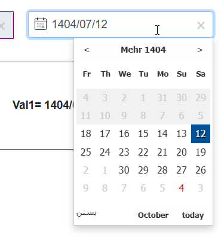
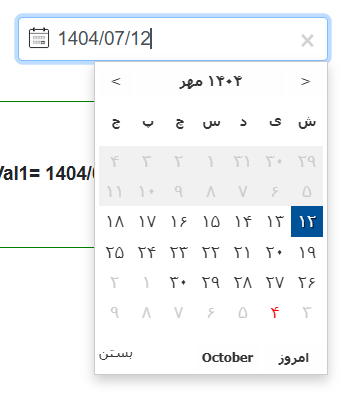

# Blazor.PersianDatePicker
 
[](https://www.nuget.org/packages/Blazor.PersianDatePicker/)
[](https://raw.githubusercontent.com/farshaddavoudi/Blazor.PersianDatePicker/master/LICENSE)

> ⭐️ If Blazor.PersianDatePicker helps your project, a quick star keeps the component visible and fuels future improvements.


##### 🎈 Optimize design after `v2.0.0` | Mark holidays (optional) after `v3.5.0` — Thanks to [@Mostafa-Moradi](https://github.com/Mostafa-Moradi) for asking [the feature](https://github.com/farshaddavoudi/Blazor.PersianDatePicker/issues/93)


> ✨ **Important fix in v3.2.0**: When we set the bound parameter value to some date by code (for example in the `OnInitialize` method of our component) and then click on the input, the selected date in the datepicker was always today, not that date. It is resolved now. Thanks to [@EsmaeelAmarloo](https://github.com/EsmaeelAmarloo) for creating [the issue](https://github.com/farshaddavoudi/Blazor.PersianDatePicker/issues/60#issuecomment-1820790657).

> ✨ **Important fix in v3.4.0 — update your package**: The 1403 Jalali leap year was miscalculated therefore all dates in the next Jalali year (1404) were wrong by one day. It is resolved now. Thanks to [@web724online](https://github.com/web724online) for creating [the issue](https://github.com/farshaddavoudi/Blazor.PersianDatePicker/issues/89).

> ⚠️ **Breaking change in v3.7.0**: The component parameter formerly named `DigitType` is now `InputDigitType`, and a new `PickerDigitType` parameter controls the digits rendered inside the popup. See [Digit Type Configuration](#digit-type-configuration). Thanks to [@AmirJoleini](https://github.com/AmirJoleini) for contributing the improvement.


## Compatibility:
It is compatible and installable on all .NET 5, .NET 6, .NET 7, .NET 8 and .NET 9 Blazor projects

## Usage:

1- Install **Blazor.PersianDatePicker** from Nuget.org

2- Add `<script src="_content/Blazor.PersianDatePicker/datepicker.min.js" type="text/javascript"></script>` to your **index.html** or **_Host.cshtml** or **App.razor** *(in .NET 8)*

3- Add `<link href="_content/Blazor.PersianDatePicker/datepicker.css" rel="stylesheet" />` to your **index.html** or **_Host.cshtml** or **App.razor** *(in .NET 8)*

4- Add `@using Blazor.PersianDatePicker` to **_imports.razor**

5- Use the component **InputPersianDatePicker** 

## Options:

```csharp
<InputPersianDatePicker 
       // Html input element id attribute 
       Id="myInputDatePicker" //Optional

       // Bind input value to local variable or dto etc
       @bind-Value="_stringVar"
       // Optional typed binds can be used at the same time: 
       // @bind-ValueAsDateTime="_dateTimeVar"
       // @bind-ValueAsDateOnly="_dateOnlyVar"

       // Html input element name attribute
       Name="myInputName" //Optional

       // Control visibility of input
       Visible="true" //Default: true

       // Disabled make input disabled. This means only showing value and the picker popup won't open
       Disabled="false" //Default: false

       // Readonly make input readonly. This means the user cannot change the picker value e.g. by typing
       ReadOnly="true" //Default: true

       // Picker'align relative to input
       // Options: Align.Right | Align.Left
       PickerAlign="Align.Right" //Default: Align.Right

       // Show calendar icon on text input
       ShowCalendarIcon="true" //Default: true

       // Calendar icon position relative to input
       // Options: IconPosition.BasedOnAlign | IconPosition.Left | IconPosition.Right
       CalendarIconPosition="IconPosition.BasedOnAlign" //Default: IconPosition.BasedOnAlign

       // Can be used in changing the vertical position of the picker popup relative to the input
       PickerOffsetTopPositionInPixels="2" //Default: 2

       // Initial value for the input set today
       InitialValueSetOnToday="false" //Default: false

       // Calendar type for date picker including Dual, Single, etc
       // Options: Calendar.DualModeJalaliDefault | Calendar.DualModeMiladiDefault | Calendar.SingleModeJalali | Calendar.SingleModeMiladi
       CalendarType="Calendar.DualModeJalaliDefault" //Default: Calendar.DualModeJalaliDefault

       // Control the digit script rendered in the input after a selection
       // Options: DigitType.BasedOnCalendar | DigitType.Persian | DigitType.English
       InputDigitType="DigitType.BasedOnCalendar" //Default: DigitType.BasedOnCalendar

       // Control the digit script rendered inside the picker UI itself
       // Options: DigitType.BasedOnCalendar | DigitType.Persian | DigitType.English
       PickerDigitType="DigitType.BasedOnCalendar" //Default: DigitType.BasedOnCalendar

       // Format of date to show in the input after selecting by picker, e.g. 1400/01/01 or 1400-01-01
       // Options: DateFormat.yyyy_slash_MM_slash_dd | DateFormat.yyyy_dash_MM_dash_dd
       DateFormat="DateFormat.yyyy_slash_MM_slash_dd" //Default: DateFormat.yyyy_slash_MM_slash_dd

       // Prevent the user from selecting a date before today
       MinDateSetOnToday="true" //Default: true

       // Input placeholder
       Placeholder="Select date"

       // CSS class for input element
       CssClass="form-control"

       // Inline styles for input element
       Style="border:1px solid red; width:50%"

       // Choose a theme for changing the look and feel of the picker
       // Options: PickerTheme.Default | PickerTheme.Dark | PickerTheme.Blue | PickerTheme.Cheerup | PickerTheme.RedBlack
       // Themes can be seen in the image
       Theme="PickerTheme.Default"

       // Mark holidays red color in Persian calendar
       MarkHolidays="true" //Default: true

       // Mark red color for the dates provided here in the calendar
       // Both "/" seperated and "-" seperated Jalali date formats are valid
       MarkedDates="@(["1403-06-25", "1403/06/27", "1403/06/28"])" //Optional

       // Input change event
       OnChange="@(() => Console.WriteLine("OK"))"
                        
       // Input text clear event (by pressing close button)
       OnClear="@(() => Console.WriteLine("Cleared"))" />

```

### Bind to `DateTime` / `DateOnly`

In addition to the classic string binding, you can keep your view models strongly typed:

```razor
<InputPersianDatePicker Id="orderDatePicker"
                        @bind-ValueAsDateTime="OrderDate"
                        CalendarType="Calendar.DualModeMiladiDefault" />

<InputPersianDatePicker Id="deadlinePicker"
                        @bind-ValueAsDateOnly="Deadline"
                        CalendarType="Calendar.SingleModeJalali" />
```

```csharp
@code {
    private DateTime? OrderDate { get; set; }
    private DateOnly? Deadline { get; set; }
}
```

Mix and match string and typed bindings in the same form depending on how you want to store dates in your domain model. You can even keep all three binds (`@bind-Value`, `@bind-ValueAsDateTime`, `@bind-ValueAsDateOnly`) on the same component. The picker keeps them synchronized, propagating whichever value changes across the other two.

## Digit Type Configuration
Using `InputDigitType` and `PickerDigitType` you can decouple the numerals rendered in the textbox from those rendered inside the popup. The default (`DigitType.BasedOnCalendar`) continues to follow the active Jalali/Miladi calendar, but you can now force English or Persian digits explicitly.

<table>
  <tr>
    <td></td>
    <td></td>
  </tr>
  <tr>
    <td align="center"><sub>`PickerDigitType="DigitType.English"`</sub></td>
    <td align="center"><sub>`PickerDigitType="DigitType.Persian"`</sub></td>
  </tr>
</table>

> **Tip:** Set `InputDigitType="DigitType.English"` while keeping `PickerDigitType="DigitType.Persian"` to show western numerals in the textbox but maintain a localized Jalali calendar grid.

> #### 💡 You can add multi-instances of InputPersianDatePicker components on a page and all of them work independently without any problem

## Sample template for fast usage:
#### Copy from here then paste in your project; change some options and you're done.

```razor
<InputPersianDatePicker Id="myInputDatePicker"
                        @bind-Value="_variable4"
                        Name="myInputName"
                        Visible="true"
                        Disabled="false"
                        PickerAlign="Align.Right"
                        PickerOffsetTopPositionInPixels="1"
                        InitialValueSetOnToday="false"
                        CalendarType="Calendar.SingleModeJalali"
                        InputDigitType="DigitType.BasedOnCalendar"
                        PickerDigitType="DigitType.BasedOnCalendar"
                        DateFormat="DateFormat.yyyy_slash_MM_slash_dd"
                        MinDateSetOnToday="true"
                        Placeholder="Select date"
                        CssClass="form-control"
                        Style="border:1px solid green; width:20%; float:right"
                        Theme="PickerTheme.RedBlack"
                        MarkHolidays="true"
                        MarkedDates="@(["1403-06-25", "1403/06/27", "1403/06/28"])"
                        OnChange="@(() => Console.WriteLine("OK"))" />
```

## Performance:

   * `js` size (gzipped) ⇒ **35 kb** 

   * `css` size (gzipped) ⇒ **5 kb** 

   * `dll` size (gzipped) ⇒‌ **9 kb** 


## Special Thanks:
  *This project was originally ported from [pwt.datepicker](https://github.com/babakhani/pwt.datepicker), a jQuery-based datepicker that is now officially deprecated. We're grateful to Reza Babakhani @babakhani and every contributor whose work laid the groundwork for this modern Blazor alternative.*


